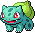

#  A Game Engine Built on Godot for VSCode

Bulbasaur is a powerful game engine that leverages the capabilities of Godot and Visual Studio Code to provide a seamless game development experience.

## Installation

Before you can use Bulbasaur, you need to install it. Follow the steps below:

```bash
# Clone the repository
git clone https://github.com/mempler/bulbasaur.git

# Navigate into the directory
cd bulbasaur

# Install the dependencies
pnpm install
```

## Usage

To run the Bulbasaur game engine:

1. Open the project in Visual Studio Code.
2. Press `F5`.

## Contributing

We welcome contributions from the community. If you'd like to contribute, please fork the repository and make your changes, then submit a pull request.

## License

Bulbasaur is licensed under the MIT License. See LICENSE for more information.
